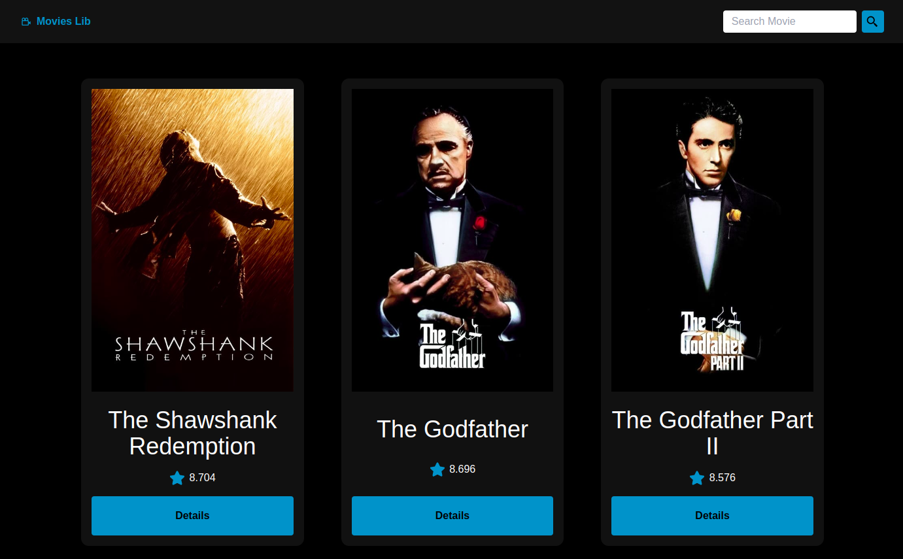
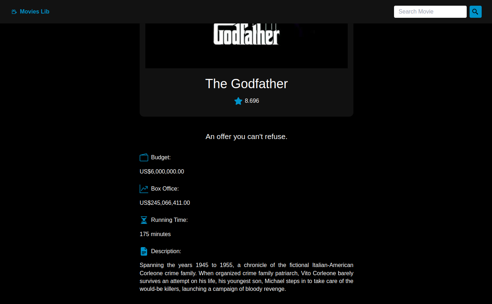
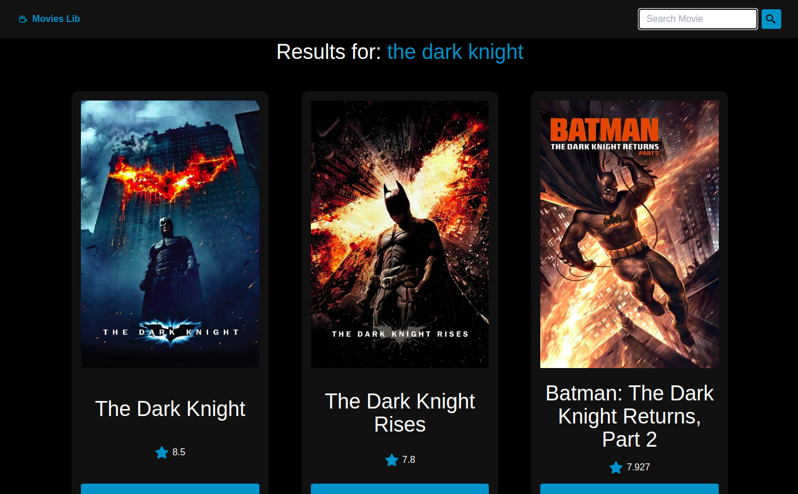

# Movies Lib
   


  - [1. Project Description](#1-project-description)
  - [2. Layouts](#2-layouts)
    - [2.1. Main Page](#21-main-page)
    - [2.2. Movie Details](#22-movie-details)
    - [2.3. Search for Movies](#23-search-for-movies)
  - [3. Prerequisites](#3-prerequisites)
    - [3.1. Node.js](#31-nodejs)
    - [3.2. TypeScript](#32-typescript)
  - [4. Installation](#4-installation)
    - [4.1. Clone the Repository](#41-clone-the-repository)
    - [4.2. Access the project directory](#42-access-the-project-directory)
    - [4.3. Install the Dependencies](#43-install-the-dependencies)
  - [5. Execute the project](#5-execute-the-project)
    - [5.1. Launch Application](#51-launch-application)
  
## 1. Project Description
Web Application builded with [ReactJS](https://reactjs.org/) which consume the movies API called [TMDB](https://developers.themoviedb.org/3/getting-started/introduction), listing the best movies evaluated by critics on the home page, and which also allows the user to use the search bar to perform a search and view the informations of the chosen movie.

## 2. Layouts

### 2.1 Main Page


### 2.2 Movie Details


### 2.3 Search for Movies


## 3. Prerequisites
### 3.1. Node.js
> Download and install [Node.js](https://nodejs.org/)
### 3.2. TypeScript
   ```sh
   npm install -g typescript
   ```
   
## 4. Installation
### 4.1 Clone the Repository
   ```sh
   git clone https://github.com/Naanon/movies_lib.git
   ```
### 4.2 Access the project directory  
   ```sh
   cd movies_lib
   ```
### 4.3 Install the Dependencies
   ```sh
   npm install
   ```
## 5. Execute the project
### 5.1. Launch Application
   ```sh
   npm run dev
   ```
